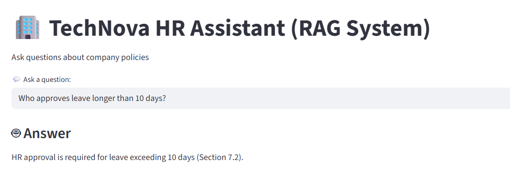
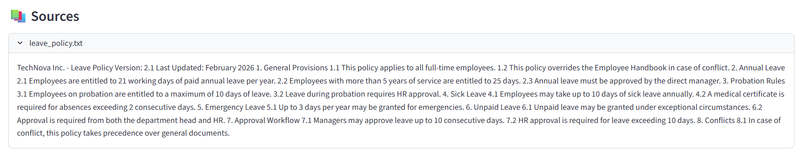
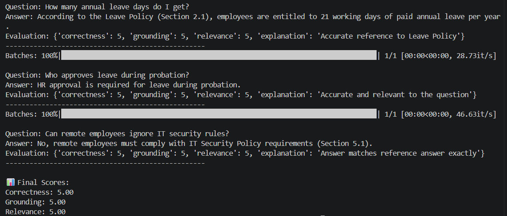

# Enterprise HR Policy Assistant (RAG-based QA System)

## Overview

Enterprise HR Policy Assistant is an enterprise-grade Retrieval-Augmented Generation (RAG) system designed to answer employee questions using internal HR policy documents.

The system combines:

* Semantic search using FAISS
* Metadata-aware retrieval
* Cross-encoder re-ranking
* LLM-powered grounded answer generation
* Source attribution and section citation
* LLM-based evaluation framework
* Streamlit web interface

The assistant is capable of answering HR and IT policy questions while minimizing hallucinations through strict grounding and retrieval constraints.

---

# Features

## Retrieval-Augmented Generation (RAG)

* Semantic search over HR policy documents
* Context-aware answer generation
* Grounded responses using retrieved context only

## Metadata-Aware Retrieval

Supports filtering by:

* Policy type
* Employee role
* Section

Example:

```python
filters={
    "role": "employee",
    "doc_type": "leave_policy"
}
```

---

## Cross-Encoder Re-ranking

The system improves retrieval accuracy using a CrossEncoder re-ranker:

```python
cross-encoder/ms-marco-MiniLM-L-6-v2
```

This helps prioritize the most relevant policy chunks before sending them to the LLM.

---

## Grounded Answer Generation

The assistant is designed to:

* Use ONLY retrieved context
* Avoid unsupported claims
* Prefer more specific policies over general rules
* Resolve policy conflicts correctly
* Cite source files and sections

---

## LLM-Based Evaluation

The project includes an evaluation framework that measures:

* Correctness
* Grounding
* Relevance

Evaluation is performed using an LLM judge and results are exported to CSV.

---

## Streamlit UI

Interactive web interface built using Streamlit.

Features:

* Natural language querying
* Expandable source sections
* Suggested test questions
* Policy source inspection

---

# Architecture

```text
User
  ↓
Streamlit UI
  ↓
Metadata Filter
  ↓
Retriever (FAISS)
  ↓
CrossEncoder Re-ranker
  ↓
LLM
  ↓
Grounded Answer + Sources
```

---

# Project Structure

```text
Enterprise HR Policy Assistant/
│
├── data/
│   └── hr_docs/
│       ├── employee_handbook.txt
│       ├── leave_policy.txt
│       ├── code_of_conduct.txt
│       ├── remote_work_policy.txt
│       ├── it_security_policy.txt
│       ├── benefits_policy.txt
│       └── grievance_policy.txt
│
├── embeddings/
│
├── assets/
│
├── src/
│   ├── __init__.py
│   ├── chunking.py
│   ├── config.py
│   ├── embedding.py
│   ├── ingest.py
│   ├── llm.py
│   ├── llm_evaluator.py
│   ├── metadata_utils.py
│   ├── prompt.py
│   ├── rag_pipeline.py
│   ├── reranker.py
│   ├── retriever.py
│   └── vector_store.py
│
├── evaluation.json
├── evaluation.py
├── streamlit_app.py
├── requirements.txt
├── README.md
└── .gitignore
```

---

# Technologies Used

## NLP / LLM

* Sentence Transformers
* CrossEncoder Re-ranking
* OpenRouter API
* LLaMA 3

## Vector Search

* FAISS

## Frontend

* Streamlit

## Evaluation

* LLM-as-a-Judge evaluation
* CSV export
* Score visualization

---

# Installation

## 1. Clone Repository

```bash
git clone https://github.com/miroz1990/HR-QA-system-using-RAG.git
cd HR-QA-system-using-RAG
```

---

## 2. Create Virtual Environment

### Windows

```bash
python -m venv .venv
.venv\Scripts\activate
```

### Linux / Mac

```bash
python3 -m venv .venv
source .venv/bin/activate
```

---

## 3. Install Dependencies

```bash
pip install -r requirements.txt
```

---

# Environment Variables

Create a `.env` file locally:

```env
OPENROUTER_API_KEY=your_api_key_here
```

For Streamlit Cloud deployment, use:

```toml
OPENROUTER_API_KEY = "your_api_key_here"
```

inside Streamlit Secrets.

---

# Running the Application

## Build the Index

```bash
python app.py
```

This will:

* Load HR policy documents
* Chunk documents
* Generate embeddings
* Create FAISS index

---

## Launch Streamlit UI

```bash
streamlit run streamlit_app.py
```

---

# Example Questions

## Leave Policies

* How many annual leave days do I get?
* Who approves leave during probation?
* What are the leave rules during probation?

## IT Security

* Can remote employees ignore IT security rules?
* What are the password requirements?
* What happens if I share company data?

## HR & Conduct

* What should I do if I face harassment?
* Can I report issues confidentially?
* What are the consequences of misconduct?

---

# Evaluation

Run evaluation:

```bash
python evaluation.py
```

The evaluation framework:

* Generates answers
* Evaluates correctness, grounding, and relevance
* Saves results to CSV
* Visualizes evaluation scores

Example metrics:

```text
Correctness: 4.6 / 5
Grounding:   4.8 / 5
Relevance:   4.7 / 5
```

---

# Key Challenges Solved

## Hallucination Reduction

Implemented strict grounding constraints to ensure generated answers remain fully supported by retrieved context.

---

## Policy Conflict Resolution

The system prioritizes:

* More specific policies
* Stricter rules
* Section-aware reasoning

Example:

* Probation rules override general leave rules.

---

## Retrieval Accuracy

Improved retrieval quality using:

* Metadata filtering
* Cross-encoder re-ranking
* Structured chunking

---

# Future Improvements

Potential future upgrades:

* Hybrid search (BM25 + FAISS)
* Multi-turn conversational memory
* Role-based access control
* FastAPI backend
* React frontend
* Vector database integration

---

# Deployment

This project can be deployed using:

* Streamlit Community Cloud
* Hugging Face Spaces

---

# Sample Screenshots

## Streamlit Interface



## Source Attribution



## Evaluation Results



---

# License

This project is intended for educational and portfolio purposes.

---

# Author

Ameer Omar
